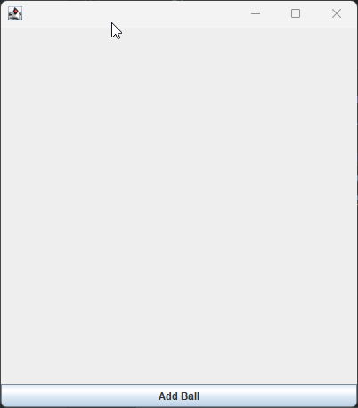

<h1 align="center">ЛАБОРАТОРНА РОБОТА №3</h1>
<h3 align="center">Тема: Багатопоточне та паралельне програмування на Java</h3>
<h3 align="center">Виконав:	Желобецький Арсеній Павлович; група 6.1221</h3>
<h3 align="center">Варіант №5</h3>

## Завдання:

Створити фрейм (Swing – додаток) з трьома кульками, що одночасно літають у вікні.
З кожною кулькою пов'язаний свій потік зі своїм пріоритетом.
При досягненні краю кадру, кулька «відскакує» під відповідним кутом.

<h3 align="center">Результат:</h3>

  

